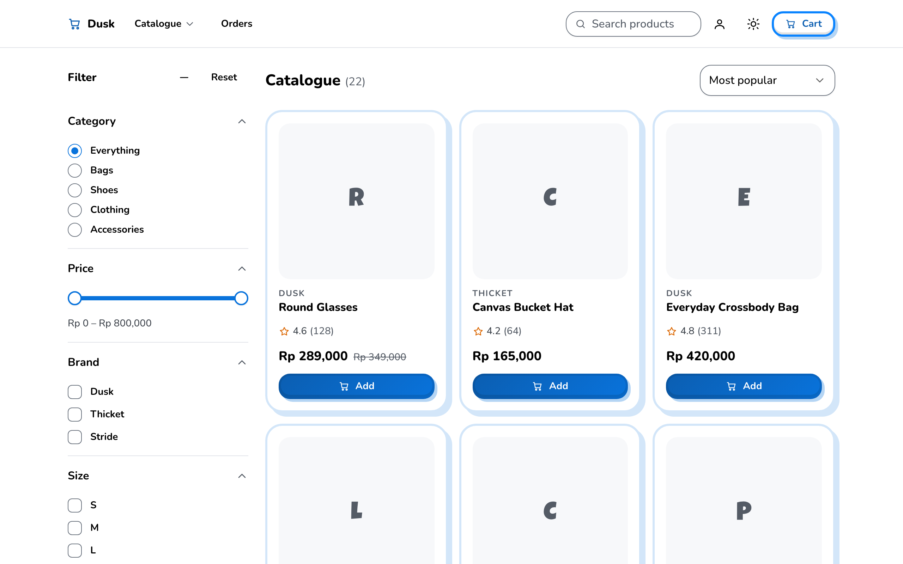
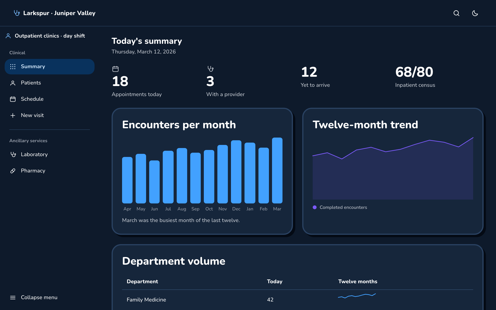

# kirua

A React design system with a playful, cut-out look: bold outlines, hard offset
shadows, rounded "Clay" corners, a vivid blue brand and a comic display face.
It began as one anime landing-page hero from Figma Community, reverse-engineered
into tokens and components, and grew into a system that also handles shops,
dense records, social feeds and chat.

Built with **React 19**, **Tailwind CSS v4** and **Radix Primitives**.

[Storybook](https://kirua-storybook.vercel.app) ·
Example app: _URL to be added_ ·
[Getting started](https://kirua-storybook.vercel.app/?path=/docs/getting-started--docs)

| Light                                                                                         | Dark (navy night)                                                                              |
| --------------------------------------------------------------------------------------------- | ---------------------------------------------------------------------------------------------- |
|  |  |

Both screens come from the example app, which is built only from kirua's
components and their props.

## Contents

- [Features](#features)
- [Quick start](#quick-start)
- [Using the components](#using-the-components)
- [Theming](#theming)
- [Project structure](#project-structure)
- [Scripts](#scripts)
- [Testing](#testing)
- [Browser support](#browser-support)
- [Contributing](#contributing)
- [License](#license)
- [Credits](#credits)

## Features

- **90 components and 31 icons.** Layout (`AppShell`, `Stack`, `Inline`,
  `Grid`, `Split`, `Pane`, `PageHeader`), typography, buttons, cards, forms,
  menus, overlays, navigation, tables, charts, feedback and decorative
  ornaments. Radix supplies the behaviour — focus management, typeahead, roving
  tabindex, collision-aware positioning, ARIA wiring — and kirua supplies the
  appearance.
- **A token architecture in four layers.** Raw primitives, semantic roles,
  Tailwind utility aliases, then components. Components read semantic roles
  only, never a raw colour.
- **Clay shapes.** A 3px outline around cards and standing buttons, a hard
  shadow offset down and towards the end of the line, 24px card corners and
  16px control corners. Buttons lift on hover and press down on click.
- **Surface contexts instead of `inverted` props.** A brand or inverse panel
  re-points the colour roles for everything inside it, so the same
  `<Button variant="primary">` is a blue button on the page and a white one on
  a blue panel.
- **Light and dark modes, with five night palettes.** Dark mode comes in navy
  (the default), graphite, onyx, ink and carbon, chosen with one attribute.
  Every text, field and chart pair is contrast-tested on each night.
- **Accessibility enforced by the test suite.** axe runs on every story and
  fails the run on a violation; composed screens are checked in both modes at
  phone and desktop widths. Forced-colours (Windows high contrast) and
  reduced-motion each have their own test project, every directional style is
  logical and tested right-to-left, and the example app is checked for WCAG
  2.5.8 target size.
- **Server rendering.** No component reads a browser API during render or holds
  state, and none carries a `"use client"` directive. The whole barrel renders
  in Node with no browser present, and server markup hydrates cleanly in
  Chromium and WebKit.
- **An example app with zero `className`.** Five small applications — a shop, a
  hospital system, a social app, an assistant and a marketing site — written
  without a single `className` or `style` prop. A check fails if one appears.

## Quick start

Requirements: Node `^20.19.0 || ^22.12.0 || >=24.0.0` and pnpm 10.

```bash
git clone https://github.com/kobars/kirua.git
cd kirua
pnpm install
pnpm exec playwright install chromium webkit   # browsers for the test suite and checks
pnpm storybook                                 # http://localhost:6006
```

In Storybook, start with **Getting started**, then **Foundations** for the
tokens and **Patterns** for composed screens. The toolbar switches the colour
**Mode**, the containing **Surface** and the **Night** palette of a story.

To run the example app:

```bash
pnpm example
```

It opens on a hub at `#/` that links to five sections:

| Section  | What it shows                                                         | Route          |
| -------- | --------------------------------------------------------------------- | -------------- |
| Dusk     | A storefront with filters, a product page, cart and checkout          | `#/shop/`      |
| Larkspur | A US hospital chart: patients, coverage, appointments, labs, pharmacy | `#/his/`       |
| Commons  | A mobile-first feed, explore, notifications, messages                 | `#/social/`    |
| Claude   | An assistant transcript, composer, searchable sidebar, usage          | `#/claude/`    |
| Aozora   | A marketing site with pricing, a story, a guide and a form            | `#/marketing/` |

Each section loads as its own chunk. All data is local sample data.

`pnpm dev` serves the rebuilt reference hero on http://localhost:5173.

## Using the components

kirua is a **Vite app with Storybook, not a published npm package**.
`package.json` is private, and there is no library build and no `exports`
field. To use the components in your own project, copy them in:

1. **Copy** `src/components`, `src/lib` and `src/styles` into your project,
   for example under `src/kirua/`. The `*.stories.tsx` and `*.test.*` files
   can be left behind.
2. **Install the runtime dependencies**: `react` and `react-dom` 19,
   `tailwindcss` 4 with its build plugin (such as `@tailwindcss/vite`),
   `class-variance-authority`, `clsx`, `tailwind-merge`,
   `react-resizable-panels` and the `@radix-ui/react-*` packages listed in
   `package.json`.
3. **Add the `@/` alias.** Components import each other as `@/components/…`
   and `@/lib/…`, so `@` must resolve to the folder holding the copied
   directories, in both your bundler and TypeScript:

   ```ts
   // vite.config.ts
   resolve: { alias: { '@': path.resolve(import.meta.dirname, 'src/kirua') } }
   ```

   ```jsonc
   // tsconfig.json → compilerOptions
   "paths": { "@/*": ["./src/kirua/*"] }
   ```

4. **Import the styles** from your stylesheet. Tailwind finds classes by
   scanning source text, so name the copied directories as sources:

   ```css
   @import 'tailwindcss';

   @source './kirua/components';
   @source './kirua/lib';

   @import './kirua/styles/kirua.css';
   ```

5. **Load the fonts** in the document head. The stylesheet does not fetch them,
   and system fonts are the fallback:

   ```html
   <link rel="preconnect" href="https://fonts.googleapis.com" />
   <link rel="preconnect" href="https://fonts.gstatic.com" crossorigin />
   <link
     rel="stylesheet"
     href="https://fonts.googleapis.com/css2?family=Luckiest+Guy&family=Nunito:wght@400..800&display=swap"
   />
   ```

Then compose:

```tsx
import { Badge, Button, Card, CardBody, CardTitle } from '@/components';

export function CollectionCard() {
  return (
    <Card padding="md">
      <Badge status="info">New collection</Badge>
      <CardTitle as="h2">Small worlds, big stories</CardTitle>
      <CardBody>Prints and accessories from independent artists.</CardBody>
      <Button asChild>
        <a href="/collections">Explore the collection</a>
      </Button>
    </Card>
  );
}
```

`examples/vite.config.ts` and `examples/styles.css` show the same setup working:
the example app imports from a `kirua` alias that points at
`src/components/index.ts`, exactly as an outside consumer would.

Some conventions every component follows:

- Props extend the native element's props, and `ref` reaches the rendered
  element (React 19, no `forwardRef`).
- `className` is merged last, so it can always override. Use it for layout;
  appearance belongs to variants and surface contexts.
- Sub-components are flat named exports (`CardTitle`, `DialogContent`), which
  keeps them usable across a React Server Components boundary.
- Every styled element carries a `data-slot` attribute named after its
  component. Slot names are public and safe to select on.
- Interactive behaviour that belongs to the application — filtering in
  `Combobox` and `Command`, validation in `Field`, previous/next controls for
  `Carousel` — is left to the application, and each component's Storybook page
  shows the code involved.

## Theming

### Light and dark

Add the `dark` class to `<html>` for dark mode. Dark mode is a set of
re-pointed variables, so components carry no `dark:` colour variants. To avoid
a flash of the wrong mode, apply the class from a small blocking script before
first paint; **Foundations → Dark mode** in Storybook has the snippet, including
a stored preference and a light/dark/system choice.

### Night palettes

Dark mode comes in five nights. Navy is the default and needs no attribute; set
`data-night-palette` on the same element as `.dark` to choose another:

```html
<html class="dark" data-night-palette="graphite"></html>
```

| Night      | Character                                            |
| ---------- | ---------------------------------------------------- |
| `navy`     | The default. Plain `.dark` gives it.                 |
| `graphite` | A nearly neutral cool grey over a pure black shade.  |
| `onyx`     | Pure neutral grey, darker than graphite.             |
| `ink`      | Navy's hue at half its chroma, so not a second blue. |
| `carbon`   | The darkest page, with a larger step up to the card. |

A night page never sits at black, because a shadow can only read as shade on a
page lighter than it. `NightSwatch` shows a night's colours in a picker even
while the page is light. The example app's theme menu offers all five nights,
remembers the choice, and accepts `?night=<name>` in the URL.

### Surface contexts

A surface sets a context class, and every colour role inside it follows:

```tsx
<Card variant="brand" padding="md">
  <CardTitle as="h2">Join the sketch club</CardTitle>
  <Button>Join club</Button>
</Card>
```

`Card variant="brand"` and `SpotlightPanel` set `.ctx-brand`; `NavBar`, the
dark `Card` and `Chip` and `Tooltip` set `.ctx-inverse`. A portalled overlay
inherits from its portal container, so set the mode on `<html>`.

### How the tokens are layered

```
tokens.primitives.css   @theme          raw values, no meaning     blue-500 = #0A84FF
        ↓
tokens.semantic.css     :root / .ctx-*  what a value means         surface-brand = blue-600
        ↓                .dark, nights
theme.css               @theme inline   Tailwind utility aliases   bg-brand → surface-brand
        ↓
src/components/*                        components read the semantic layer only
```

`@theme inline` compiles utilities to live `var(--color-…)` references, which
is what lets a context class or a night palette change colours at runtime.
Values marked `[FIGMA]` in the CSS were measured from the reference design;
everything else was designed to fill the gaps one marketing screen leaves.
Where the system departs from the reference for contrast — the brand surface is
`blue-600` rather than the measured `blue-500`, for example — the reason is
written beside the token.

## Project structure

```
src/
  components/      the components, their stories, variants and tests; index.ts is the barrel
  styles/          the token layers, Tailwind aliases, animations and kirua.css
  lib/             cn(), cva, contrast maths and shared helpers
  foundations/     Storybook pages for colour, type, scales, surfaces and dark mode
  patterns/        the rebuilt reference hero and composed everyday screens
  board/           a small task-board viewer, built with the system
  index.css        the hero page's stylesheet
examples/
  index.html       the example app: one page, hash-routed
  App.tsx, Hub.tsx the router and the hub at #/
  shop/ his/ social/ claude/ marketing/   one directory per section
  shared/          the theme and night menu, routing and other shared hooks
  styles.css       imports and @source lines only
tools/             the example-app checks, size budgets and the dead-class check
public/            favicon and the hero's character artwork
docs/screenshots/  the images in this README
.storybook/        Storybook configuration and the Mode, Surface and Night toolbar
```

## Scripts

| Command                 | What it does                                                                        |
| ----------------------- | ----------------------------------------------------------------------------------- |
| `pnpm storybook`        | Storybook on http://localhost:6006                                                  |
| `pnpm example`          | The example app in development                                                      |
| `pnpm dev`              | The rebuilt hero page on http://localhost:5173                                      |
| `pnpm board`            | The task-board viewer                                                               |
| `pnpm build`            | Type-check, build the hero page, check for dead classes and enforce the size budget |
| `pnpm build:examples`   | Build the example app into `examples/dist`                                          |
| `pnpm build-storybook`  | Build static Storybook into `storybook-static`                                      |
| `pnpm check`            | The whole gate: types, dead classes, lint, formatting, tests with coverage, WebKit  |
| `pnpm test`             | Every Vitest project except WebKit, once                                            |
| `pnpm test:coverage`    | The tests with coverage thresholds for `src/lib`                                    |
| `pnpm test:webkit`      | The unit tests again in WebKit                                                      |
| `pnpm lint`             | oxlint, including Tailwind class rules; warnings fail                               |
| `pnpm lint:fix`         | Apply the auto-fixable lint findings                                                |
| `pnpm format`           | Prettier, including Tailwind class order                                            |
| `pnpm check:examples`   | Build the example app and run every check below in order                            |
| `pnpm check:dogfood`    | No example writes raw markup a component already covers                             |
| `pnpm check:usage`      | Every exported component is placed by the example app                               |
| `pnpm check:classname`  | No `className` or `style` in the example app, and no stylesheet rules of its own    |
| `pnpm check:responsive` | Every route at five widths: no sideways scroll, WCAG target size                    |
| `pnpm check:a11y`       | axe on every route, light and dark, phone and desktop                               |
| `pnpm check:perf`       | JavaScript and CSS budgets per section, plus DOM size, paint and CSS coverage       |
| `pnpm check:journeys`   | Complete user flows through each section of the built app                           |
| `pnpm check:lighthouse` | Local Lighthouse measurements, reported rather than gated                           |
| `pnpm check:storybook`  | Build Storybook and check its toolbar, navigation and portals in a real browser     |

## Testing

Tests run in real browsers through Vitest's browser mode and Playwright. Each
file belongs to exactly one project, chosen by its suffix:

| Project                      | Files                  | Why it is separate                                         |
| ---------------------------- | ---------------------- | ---------------------------------------------------------- |
| `storybook:{below-md,md,lg}` | every `*.stories.tsx`  | Each story is a test, with its `play` function and axe run |
| `unit:{below-md,md,lg}`      | `*.test.{ts,tsx}`      | Unit and integration tests at three widths                 |
| `visual`                     | `*.visual.test.tsx`    | Screenshot comparison: one browser, one width              |
| `node`                       | `*.node.test.{ts,tsx}` | No browser at all, which is what proves server rendering   |
| `forced-colors`              | `*.forced.test.tsx`    | A browser context option no single test can turn on        |
| `reduced-motion`             | `*.reduced.test.tsx`   | The same, for reduced motion                               |
| `webkit`                     | `*.test.{ts,tsx}`      | The unit tests in the second engine                        |

Run one file or one story by name:

```bash
pnpm exec vitest --run --project storybook:lg src/components/Badge.stories.tsx
pnpm exec vitest --run --project storybook:lg -t "Variants"
```

**Visual baselines are committed** in `src/components/__screenshots__`, and a
missing baseline fails the run. To approve an intended visual change, delete the
affected PNG, re-run the `visual` project, and commit the new PNG with the
change. Baselines are Chromium on macOS.

Every component needs a story file of its own, and a story needs a `play`
assertion for the behaviour that would otherwise fail silently. The example-app
checks then test what a single story cannot: composed screens, landmarks,
heading order, layout at real widths and bundle size.

Automated checks cover the states they test. They do not establish full
accessibility conformance, and composed screens still need keyboard and
assistive-technology review.

## Browser support

Chrome and Edge 120, Safari 16.4 and Firefox 128, declared in `browserslist`
and used as the build target. The test suite runs in Chromium and WebKit;
Firefox is a build target but is not exercised by the automated tests.

## Contributing

See [CONTRIBUTING.md](CONTRIBUTING.md) for documentation, story and
verification conventions. kirua learns from shadcn/ui's composable approach but
does not depend on it.

## License

The code is released under the [MIT License](LICENSE).

The MIT License does **not** cover third-party artwork. In particular:

- The hero's design comes from a Figma Community file (see [Credits](#credits)).
  The rebuild of it in `src/patterns/AnimeHero.tsx` and the measured `[FIGMA]`
  values reproduce that design; its rights remain with its author.
- The character images in `public/characters/` are fan renders of Killua
  Zoldyck from _Hunter x Hunter_ (Yoshihiro Togashi, Shueisha). They are
  included only to demonstrate the hero layout, are not licensed for any
  commercial use, and must be replaced before anything built on this
  repository is distributed.

## Credits

The reference design is _Figma Anime Website UI Design: Futuristic & Interactive
Hero Section_ by **@Dsingr**, published on Figma Community. kirua's base style —
the blue brand, the rounded corners, the display type and the corner ornaments
— was measured from it.

Built on [Radix Primitives](https://www.radix-ui.com/primitives),
[Tailwind CSS](https://tailwindcss.com) and
[class-variance-authority](https://cva.style). Typefaces are
[Luckiest Guy](https://fonts.google.com/specimen/Luckiest+Guy) and
[Nunito](https://fonts.google.com/specimen/Nunito), served by Google Fonts.
