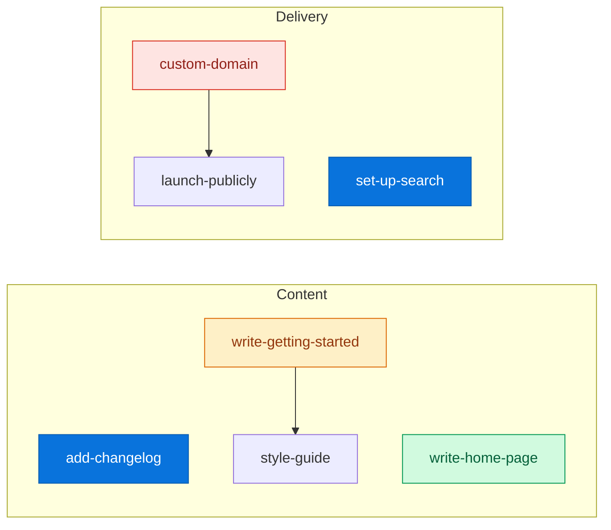

# Lantern board (sample)

A small, fictional board for a documentation site called Lantern. It exists so
that the board app has something to render on a machine with no local overlay:
the real `board/` is never committed, and an app that only works beside it
would build on one machine and fail on every other.

Everything here is invented. It is shaped like the real bundle — the same
`type`s, the same states, one dependency edge, one decision — and it is
checked by the same attester: `node board/tools/validate.mjs src/board/sample`.

**How the app chooses.** The loader takes a bundle as an argument; it never
decides on its own. `pnpm board` globs the real `/board/**/*.md` at build time
and passes it when the glob finds anything, and this sample when it finds
nothing — a fresh clone, a collaborator, a reviewer. Storybook and tests pass
the sample explicitly, so they render the same board on every machine.

Everything below the marker is generated — edit a task file, then run
`node board/tools/render.mjs src/board/sample`.

<!-- BOARD:START — generated by tools/render.mjs. Do not edit by hand. -->

## Next action

**[Add a changelog page](tasks/add-changelog.md)** — Readers returning after a month should see what moved.

| Backlog | Ready | Doing | Blocked | Done | Held |
|---|---|---|---|---|---|
| 1 | 2 | 1 | 1 | 1 | 1 |

## Dependency graph

Arrows mean *cannot be correct until*. Anything with no arrow between it
runs in parallel.

## Board

### Ready — start here (2)

* [Add a changelog page](tasks/add-changelog.md)
* [Set up search](tasks/set-up-search.md)

### Doing (1)

* [Write the getting-started guide](tasks/write-getting-started.md)

### Blocked — waiting on something outside the board (1)

* [Point the custom domain at the site](tasks/custom-domain.md)

### Backlog — waiting on a dependency (1)

* [Write the prose style guide](tasks/style-guide.md) — waits on `write-getting-started`

### Held — needs a human decision (1)

* [Announce the launch](tasks/launch-publicly.md) — waits on `custom-domain`

### Done (1)

* [Write the home page](tasks/write-home-page.md)

## Epics

* [Content](epics/content.md) — 1/4 cards. The pages a reader actually comes for.
* [Delivery](epics/delivery.md) — 0/3 cards. Getting the pages to a reader.

<!-- BOARD:END -->
